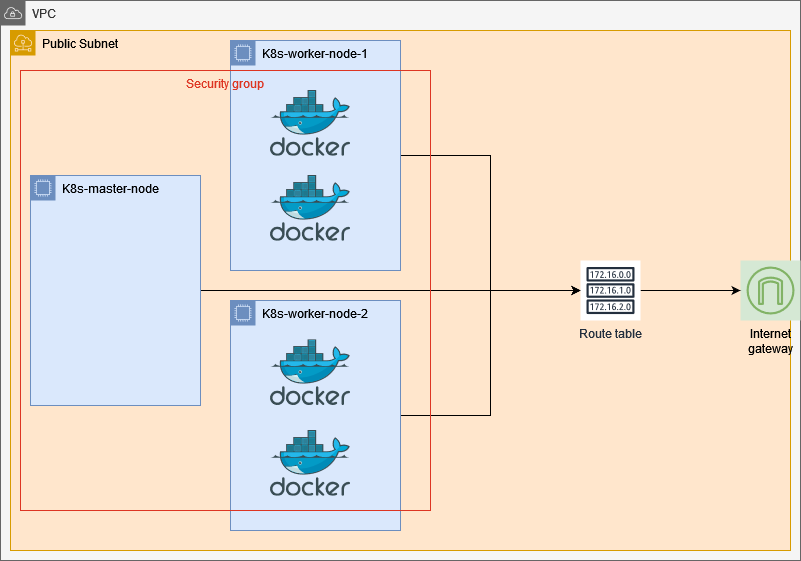

# Waqqly: A web app for booking local dog walkers!

This user-friendly web app connects dog owners with reliable walkers in their area, streamlining scheduling and ensuring happy pups (and stress-free owners)!

## Environment Variables

To run this project, you will need to add the following environment variables to your .env file.

The `.env` file is already present in every micro-service.

## Run Locally

### Manual

- Make sure you install `git` in your system and then clone the repo.

```bash
  git clone <project-url>
```

- Install `Nodejs` in you system and then go into each directory and initialize that micro-service.
  One such example is given below.

```bash
  cd bookings
  npm install
```

- Do this for all sub-directories except the gateway and then go into gateway directory.

```bash
  cd gateway
  npm install
  npm dev
```

- This will start the server in development mode and will serve on `localhost:3000`.

### Docker (Preffred method)

- Install `Docker` and `docker compose` in your system and run the following command.

```bash
  docker compose -f docker-compose.yml down && \
  docker compose -f docker-compose.yml up --build
```

- If this shows an error that `docker compose` command not found, then try the following commands.

```bash
  docker-compose -f docker-compose.yml down && \
  docker-compose -f docker-compose.yml up --build
```

- This will kill any docker processes if running, build the images from scratch and then run the containers.
- This server will also serve on `localhost:3000`.

## Deployment

This project is deployed on Kubernetes.

### Architecture
This is how the architecture of our deployment looks like on AWS.



### Deployment steps

- Make sure you have kubernetes cluster running on cloud or on-premise.
- Install `kubectl` and connect it with your cluster
- Use the following command to check if the cluster is up and running

```bash
  kubectl get nodes
```

- Go into the `k8s` directory

```bash
  cd k8s
```

- Apply all the configuration files

```bash
  kubectl apply -f .
```

- This will apply the configurations and your app should be up and running.
- To get the public ip of you cluster to test your app, use the following command.

```bash
  kubectl get svc gateway-service -o wide
```

This will output the details and you can see the public ip of your cluster to connect to.
